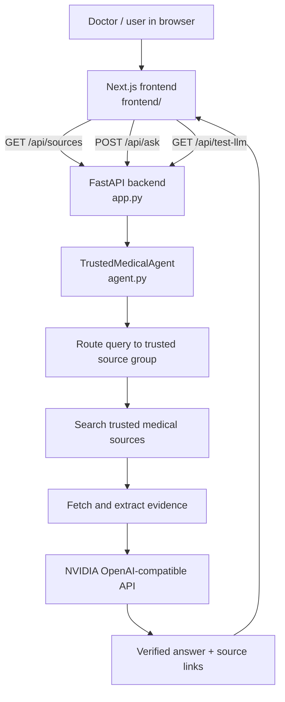

# Trusted Medical Search Agent

Separate FastAPI backend and Next.js frontend for a medical search assistant backed by NVIDIA's OpenAI-compatible API.

## What changed

- Removed Cloudflare Workers, D1, Vectorize, and Wrangler.
- Switched the LLM provider to NVIDIA using the OpenAI client.
- Kept the trusted-source routing, retrieval, verification, and NVIDIA key check flow.

## Trusted source groups

- Clinical guidelines: NICE, WHO, CDC, ACC, AHA, IDSA, ACOG, AAFP, AAD, ASCO, KDIGO, GINA
- Drug and safety sources: FDA, DailyMed, MedlinePlus, NCBI
- Evidence sources: PubMed, PMC, NCBI
- Public health sources: WHO, CDC, NIH

## Runtime

- Backend: FastAPI API only
- Frontend: Next.js app in `frontend/`
- LLM: NVIDIA `https://integrate.api.nvidia.com/v1`
- No sign-in screen, user database, or audit log flow

## Flow



Request path:
- The browser loads the Next.js UI.
- The UI calls the FastAPI backend for sources and answers.
- The backend routes the query through the trusted-source agent.
- The agent gathers evidence and sends only supported context to NVIDIA.
- The final response returns with source links for each answer.

## Environment variables

- `NVIDIA_API_KEY`
- `NVIDIA_BASE_URL` optional, defaults to `https://integrate.api.nvidia.com/v1`
- `NVIDIA_CHAT_MODEL` optional, defaults to `z-ai/glm-5.1`

## Run locally

Backend:

```bash
pip install -r requirements.txt
uvicorn app:app --reload --port 8000
```

Frontend:

```bash
cd frontend
npm install
npm run dev
```

Open `http://127.0.0.1:3000`.

If the frontend should point at a different backend URL, set `NEXT_PUBLIC_API_BASE_URL` in `frontend/.env.local`.

## Notes

- Do not hardcode the NVIDIA API key in code.
- The API key you pasted in chat should be rotated because it was exposed.
- The app is always connected and does not use a sign-in screen.
