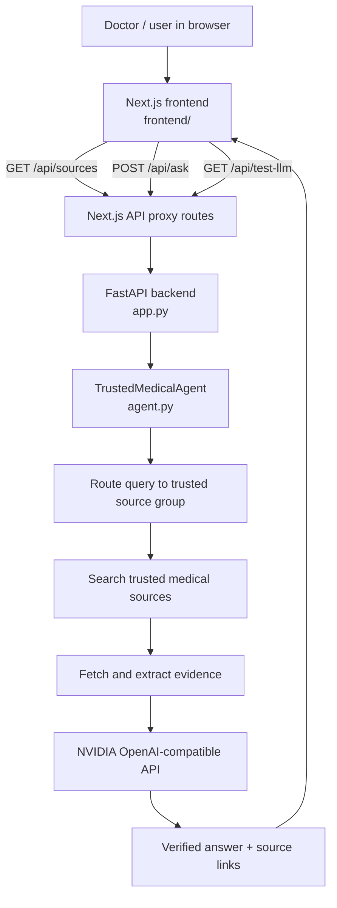
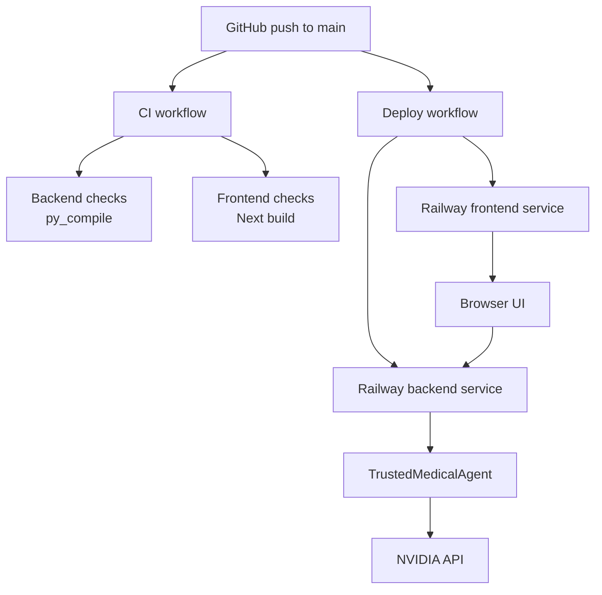

# Trusted Medical Search Agent

Separate FastAPI backend and Next.js frontend for a medical search assistant backed by NVIDIA's OpenAI-compatible API.

## What changed

- Removed Cloudflare Workers, D1, Vectorize, and Wrangler.
- Switched the LLM provider to NVIDIA using the OpenAI client.
- Kept the trusted-source routing, retrieval, verification, and NVIDIA key check flow.

## Trusted source groups

- Clinical guidelines: NICE, WHO, CDC, ACC, AHA, IDSA, ACOG, AAFP, AAD, ASCO, KDIGO, GINA
- Drug and safety sources: FDA, DailyMed, MedlinePlus, NCBI
- Evidence sources: PubMed, PMC, NCBI
- Public health sources: WHO, CDC, NIH

## Runtime

- Backend: FastAPI API only
- Frontend: Next.js app in `frontend/`
- LLM: NVIDIA `https://integrate.api.nvidia.com/v1`
- No sign-in screen, user database, or audit log flow
- The frontend proxies `/api/*` calls server-side so the browser never talks to `127.0.0.1`.

## Flow



Request path:
- The browser loads the Next.js UI.
- The UI calls the Next.js API proxy routes on the same frontend domain.
- The proxy routes forward requests to the FastAPI backend.
- The backend routes the query through the trusted-source agent.
- The agent gathers evidence and sends only supported context to NVIDIA.
- The final response returns with source links for each answer.

## Railway deployment

This repo is now ready for Railway with two services:

- Backend service: root `Dockerfile`
- Frontend service: `frontend/Dockerfile`

GitHub Actions:

- `.github/workflows/ci.yml` runs Python and Next.js checks on every push and pull request.
- `.github/workflows/deploy-railway.yml` deploys both services to Railway when the required secrets are present.

Required GitHub secrets:

- `RAILWAY_TOKEN`
- `RAILWAY_PROJECT_ID`
- `RAILWAY_BACKEND_SERVICE_ID`
- `RAILWAY_FRONTEND_SERVICE_ID`
- `RAILWAY_ENVIRONMENT` optional, defaults to `production`

Railway runtime notes:

- The backend listens on `PORT` and defaults to `8000`.
- The frontend listens on `PORT` and defaults to `3000`.
- Set `NEXT_PUBLIC_API_BASE_URL` in the Railway frontend service to the backend URL.

## Environment variables

- `NVIDIA_API_KEY`
- `NVIDIA_BASE_URL` optional, defaults to `https://integrate.api.nvidia.com/v1`
- `NVIDIA_CHAT_MODEL` optional, defaults to `z-ai/glm-5.1`

## Run locally

Backend:

```bash
pip install -r requirements.txt
uvicorn app:app --reload --port 8000
```

Frontend:

```bash
cd frontend
npm install
npm run dev
```

Open `http://127.0.0.1:3000`.

If the frontend should point at a different backend URL, set `NEXT_PUBLIC_API_BASE_URL` in `frontend/.env.local`.
The deployed frontend reads that same variable on the server side for proxying, but the browser only sees `/api/*` routes.

## Cloud build flow



## Notes

- Do not hardcode the NVIDIA API key in code.
- The API key you pasted in chat should be rotated because it was exposed.
- The app is always connected and does not use a sign-in screen.
